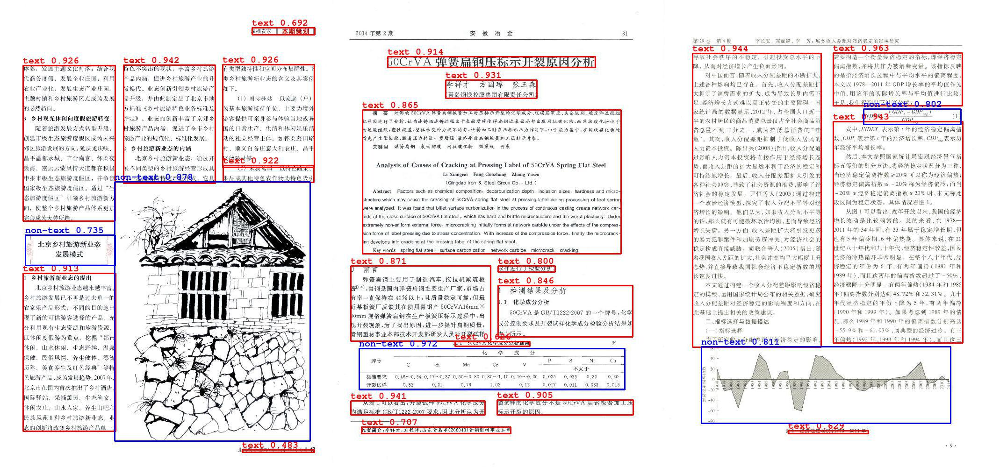
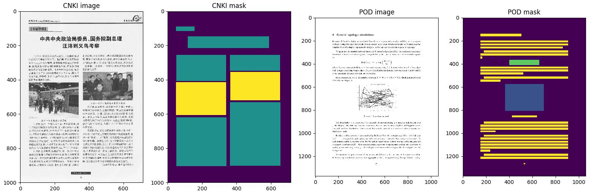
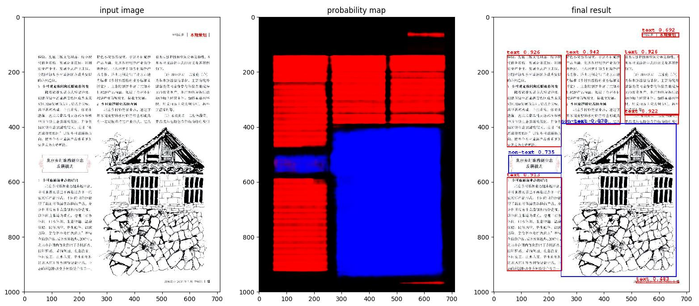
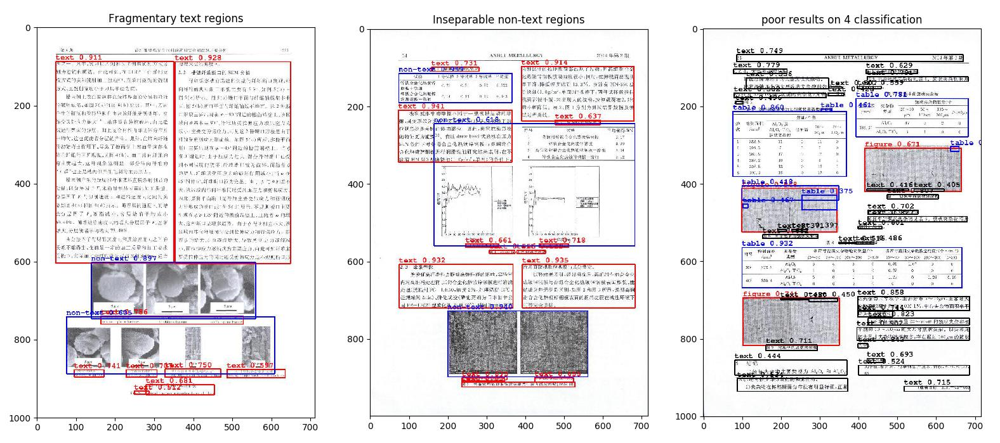

# Deep Learning Based Page Layout Analyze

This is a Python implementaion of page layout analyze tool. The goal of page layout analyze is to segment page images into different regions and recoginize them into different classes. A sementic segmentation model is trained to predict a pixel-wise probability map and a simple post-processing procedure is utilized to generate final detection bounding boxs and their corresponding labels and confidence scores. Here is what this code can do:



## Requirements ##

This repository is mostly written in Python, so Python is essential to run the code. For now, only **Python2** (Python2.7 is tested) is supported and it needs some minor modifications if you want to run this code on Python3.

The core of this repository is [DeepLab_v2](https://arxiv.org/abs/1606.00915), which is a [image semantic segmentation](http://blog.qure.ai/notes/semantic-segmentation-deep-learning-review) model. We use a TensorFlow implementation of DeepLab_v2 [DeepLab-ResNet-TensorFlow](https://github.com/DrSleep/tensorflow-deeplab-resnet) written by DrSleep, so **[TensorFlow](https://www.tensorflow.org/)** needs to be installed before running this code. We use TensorFlow v1.4 and it may need some slightly change if you are using other version of TensorFlow. Also, we need all the requirements from DeepLab-ResNet-TensorFlow. 

* Cython>=0.19.2
* numpy>=1.7.1
* matplotlib>=1.3.1
* Pillow>=2.3.0
* six>=1.1.0

Also [Scikit-image](http://scikit-image.org/) is required for image processing.

* scikit-image>=0.13.1

To install all the required python packages, you can just run

```bash
pip install -r requirements.txt
```

or for a local installation, run

```bash
pip install -U -r requirements.txt
```

## Usage ##

The code is packaged into a Python function and a Python module with a main function, which will produce exactly the same final detection results. For simplifying the usage, all the parameters are fixed except for the number of classes and visual result flag. One can easily extend the function to accept the parameters that need to be altered.

First, you need to save all the images in a folder and all the images should be in 'jpg' format. Then, a output directory need to be specified to save all the output predictions that include the down-sampled images, probability maps, visualization results and a JSON file with final detection results. The output directory does **not** have to exist before running the code (if there isn't one, we will create one for you). Finally you can run this code by calling the function in a bash terminal or import the module in Python and either way will do.

#### Function

[PageAnalyze.py](./PageAnalyze.py) is the good point to start with. Just call this function and magic will happen.

```bash
python PageAnalyze.py --img_dir=./test/test_images \
                      --out_dir=./test/test_outputs \
                      --num_class=2 \
                      --save=True
```

#### Module

[example.py](./example.py) gives the easiest way to import the module and call the main function.

```python
import sys
# Add the path of the great module and python sripts.
sys.path.append('utils/')

# Import the great module.
import page_analyze

# The image directory containing all the images need to be processed.
# All the images should be the '.jpg' format.
IMAGE_DIR = 'test/test_images/'

# The output directory saving the output masks and results.
OUTPUT_DIR = 'test/test_outputs/'

# Classes number: 2 or 4.
# 2 --- text / non-text: trained on CNKI data.
# 4 --- figure / table / equation / text: trained on POD data (beta).
CLASS_NUM = 2

# Calling the great function in the great module.
page_analyze.great_function(image_dir=IMAGE_DIR, \
	                        output_dir=OUTPUT_DIR, \
	                        class_num=CLASS_NUM, \
	                        save=True)

# The final detection results will be saved in a single JSON file.
import json
RESULTS = json.load(open(OUTPUT_DIR + 'results.json', 'r'))
```

#### Output

If the visual result flag is set to True, then the visualization results will be saved at [output_dir/predictions/](). To save the running time, the default value of this flag is False.

Final results will be coded into **a single JSON** file at [output_dir/results.json](). Here is the example of the JSON file.

```json
{
	"3005": 
	{
		"confs": [0.5356797385620915, 0.913904087544255, 0.7526443014705883, 0.9095219564478454, 0.8951748322262306, 0.6817004971002486, 0.9001002744772497, 0.9337936032277651, 0.8377339456847807, 0.7026428593008852, 0.8779250071028856, 0.8281628004780167, 0.8653182372135079, 0.7315979265269327, 0.5775715633847122, 0.6177185356901381], 
		"labels": [1, 1, 1, 1, 1, 1, 1, 1, 1, 1, 1, 1, 1, 2, 2, 2], 
		"bboxs": [[130, 219, 158, 477], [395, 347, 484, 1990], [543, 725, 714, 1605], [800, 257, 1068, 2082], [1137, 1209, 2007, 2168], [1175, 185, 1230, 429], [1268, 171, 1910, 1123], [1897, 164, 2316, 1123], [2055, 1209, 2986, 2165], [2364, 175, 2567, 1120], [2691, 171, 2942, 1123], [3038, 1213, 3272, 2165], [3052, 168, 3261, 1123], [2594, 563, 2694, 749], [2608, 1055, 2684, 1113], [2979, 1464, 3048, 2161]]
	}, 
	
	"3004": 
	{
		"confs": [0.630786120259585, 0.7335585214477949, 0.8283411346491016, 0.7394772139625081, 0.6203790052606408, 0.7930634196637656, 0.9062854529210855, 0.8209901351845086, 0.9105478240273018, 0.6283956118923438, 0.9496875863021265, 0.8075845380525092, 0.9290070507407969, 0.899121940386255, 0.9245526964953498], 
		"labels": [1, 1, 1, 1, 1, 1, 1, 1, 1, 1, 1, 2, 2, 2, 2], 
		"bboxs": [[996, 1297, 1054, 1581], [1037, 212, 1201, 1026], [1102, 1208, 1259, 2115], [1807, 143, 2163, 1102], [1988, 1293, 2043, 1574], [2094, 1317, 2245, 2016], [2272, 1191, 2385, 2142], [2437, 1191, 2491, 1742], [2529, 1180, 3265, 2149], [2728, 164, 2820, 1067], [2875, 140, 3258, 1112], [219, 164, 1026, 2135], [1211, 191, 1776, 1037], [1287, 1235, 1981, 2105], [2197, 277, 2683, 985]]
	},
	
} 
```

## Descriptions ##

The pipeline of our model contains two parts: the semantic segmentation stage and the post-processing stage. We adopt [DeepLab_v2](https://arxiv.org/abs/1606.00915) to preform a semantic segmentation procedure, and use the TensorFlow implementation [DeepLab-ResNet-TensorFlow](https://github.com/DrSleep/tensorflow-deeplab-resnet) to train our semantic segmentation model. For post-processing part, we get the bounding box locations along with their confidence scores and labels by analysing the connected component on the probability map generated from our segmentation model.

#### Training

In order to train the segmentation model, we prepare the pixel-wise mask labels on CNKI dataset and [POD dataset](http://www.icst.pku.edu.cn/cpdp/ICDAR2017_PODCompetition/index.html). 

* CNKI dataset contains total 14503 images with text / non-text annotations, and most of them are in Chinese language. 

* POD dataset contains 11333 images all in English with a four-class labeling which is figure / table / equation / text. 

Noted that CNKI dataset is noisy because it is annotated by a software, but POD dataset has a lot less noise. Also, text are annotated as regions in CNKI dataset while each text line is labeled in POD dataset. Here are the examples of CNKI dataset and POD dataset.



For CNKI dataset and POD dataset, we train two DeepLab models separately. We initialize the network by the [model pre-trained on MSCOCO](https://drive.google.com/drive/folders/0B_rootXHuswsZ0E4Mjh1ZU5xZVU). And each model was trained by 200k steps with batch size 5 and random scale 321\*321 inputs. It took roughly 2 days to converge the model on a single GTX1080 GPU. During the training, all the other hyper paremeters we use are the default values in [DeepLab-ResNet-TensorFlow](https://github.com/DrSleep/tensorflow-deeplab-resnet). The mAPs on the training sets of two datasets are **0.909** and **0.837**.

This repository does **not** contain the code for training in the reason that we want this repository keep an acceptable size (or else we need to pack the data as well). But we do put the trained models [mdoel_cnki](./models/model_cnki) and [mdoel_pod](./models/model_pod) in the models folder for inference.

#### Testing

At inference time, there are four steps and each one is written in a Python module in the utils folder. Either the function or the module calls the [page_analyze module](./utils/page_analyze.py) which calls those four modules in turn.

* [Configuration module](./utils/config.py) generates the image list file and configuration dictionary.

* [Pre-processing module](./utils/pre_process.py) re-scales (down-samples) large images and dump the scale JSON file. Due to the limit of GPU memory, we down-sample the image with height larger than 1000 pixels to 1000 and keep the aspect ratio.

* [Segmentation module](./utils/inference.py) is the core module of this code. It sets up a FIFO queue for all the input images and feeds them into the deep neural network. The probability maps generated by the DeepLab model will be saved in the output directory.

* [Post-Processing module](./utils/post_process.py) reads the original images and generated probability masks ro get the bounding box locations and their labels and confidence scores. If the save flag is set to Ture, the detection results will be drew on the original images and saved in the output directory. The final results will be written in a single JSON file we have mentioned before.

Here are a simple demo of the detection pipline.



## Running Time ##

We conduct some simple running time analysis on our server (14 cores E5-2680-v4\*2 and 8GB GTX1080\*2). [Configuration module](./utils/config.py) takes nearly no time and the rest of the modules running time is linear to the image number. So we run the code on 51 test images and compute the average time per image for each module. For GPU we only use **one GTX1080 GPU** and perform **multi-processing on CPU**.

|          | [pre_process](./utils/pre_process.py) | [inference](./utils/inference.py) | [post_process](./utils/post_process.py) |
| :------: | :-----------------------------------: | :-------------------------------: | :-------------------------------------: |
| CPU time | 0.53s / 0.05s                         | 3.98s                             | 0.07s / 0.10s                           |
| GPU time | -                                     | 0.27s                             | -                                       |

* For [pre_process](./utils/pre_process.py), a size 3000\*2000 image is quite large for deep learning so we have to down-sample the input image (due to the limit of GPU memory) and this is the most time-consuming part. We took the down-sampled images as inputs and run the code again, and it only took 0.05s per image for the reason we don't need to re-sacle the input images.

* For [inference](./utils/inference.py), it is a feed-forward precedure through the deep neural network, so the time gap between CPU and GPU is enormous. Noted that we only use one GTX1080, so it should be at least twice faster when running on a decent GPU like Titan X.

* For [post_process](./utils/post_process.py), connected component analysis is time-consuming, but suprisingly fast on this case. Also, there is a slightly difference between 2 classification and 4 classification which is 0.07s versus 0.10s

In general, now it takes us about **a second** to process one image. But if the sizes of the input images are smaller, it is likely to achieve **4 to 5 FPS**, that is 4 or 5 images per second, with the help of **a nice GPU** of course.

## Problem ##

We analyze the weakness of this algorithm by 51 test images and the main problem is from the post-processing procedure. Since the DeepLab model achieves 0.909 mAP, there is not a lot space to improve on the deep learning model. We categorize the problem into three types.



* Fragmentary text regions (especially in captions). This is because the CNKI data **annotated all the captions as text regions**, and these extremely small text regions are very close to the non-text region (like a figure or a table) which can harm the training of deep neural network. So at the inference time, the network may predict some separable text regions on the captions causing the bad results. 

* Inseparable non-text regions (causing overlaping between regions). There is only two classes (text / non-text) in CNKI dataset, so the network **can not tell the difference between figures and tables**. Sometimes, some different but close table and figure regions may be predicted as one non-text region together which may cause overlaping with other regions (which is very bad for the recognition procedure afterwards).

* Poor results on 4 classification (different data distribution). Since the 4 classes model is trained on POD dataset which has **different distribution** compared with CNKI dataset (language, layout and different text regions). So there is inevitable some bad results on CNKI test sets when we try to use the model trained on POD dataset. (We have already beaten the second place on [POD competition](http://www.icst.pku.edu.cn/cpdp/ICDAR2017_PODCompetition/results.html) by training the figure / table / equation model and using basically the same post processing procedure.)

## Todo ##

* Improve the post processing procedure to get a better result.

* Modify the code to run on Python3.
